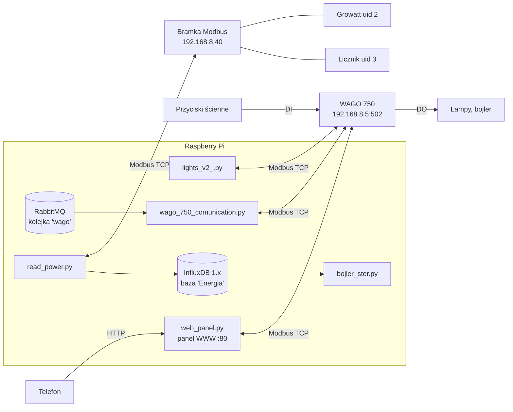

# dzarwisV2

System automatyki domu: sterowanie oświetleniem przez sterownik **WAGO 750** oraz zbieranie danych o produkcji i zużyciu energii (falownik Growatt + licznik energii). Całość działa jako zestaw skryptów Pythona na **Raspberry Pi**, które komunikują się z urządzeniami przez **Modbus TCP**.



## Skrypty

| Plik | Rola | Status |
|---|---|---|
| `scripts/lights_v2_.py` | Obsługa przycisków: zbocze opadające na wejściu WAGO przełącza przypisaną lampę | **produkcyjny** — usługa `lights.service` na Pi |
| `scripts/web_panel.py` + `scripts/web/` | Panel WWW na telefon: włączanie/wyłączanie świateł, http://192.168.8.18/ | **produkcyjny** — usługa `web.service` na Pi |
| `scripts/wago_750_comunication.py` | Sterowanie wyjściami WAGO poleceniami JSON z kolejki RabbitMQ | nieuruchomiony na Pi (wymaga Pythona ≥ 3.9) |
| `scripts/read_power.py` | Co 10 s odczyt Growatta i licznika, zapis do InfluxDB | nieuruchomiony na Pi |
| `scripts/bojler_ster.py` | Logika grzania bojlera (taryfa, nadwyżka PV) — **tylko wypisuje decyzje** | niedokończony |
| `scripts/dzarwis_global_vars.py` | Wspólna konfiguracja: adresy, lista wyjść, taryfa | moduł |
| `scripts/queue_tester.py` | Przykład wysłania polecenia do kolejki `wago` | narzędzie |
| `scripts/lihgts.py` | Poprzednia wersja obsługi przycisków (reaguje na poziom, nie na zbocze) | przestarzały |
| `scripts/brudnopis.py` | Kopia poprzedniej wersji `lights_v2_.py` (sprzed 2026-09-18) | brudnopis |
| `scripts/test.py` | Test formatowania bitów | brudnopis |

## Szybki start

```bash
python3 -m venv .venv
. .venv/bin/activate
pip install -r requirements.txt
cd scripts            # skrypty importują dzarwis_global_vars jako moduł lokalny
python lights_v2_.py
```

Wymagania środowiska: Python ≥ 3.7 (produkcyjne Pi ma 3.7.3; `wago_750_comunication.py` wymaga ≥ 3.9), sieć 192.168.8.0/24 (WAGO, bramka Modbus), RabbitMQ i InfluxDB 1.x na localhost (tylko dla skryptów, które ich używają).

Na produkcyjnym Raspberry Pi skrypt działa jako usługa systemd `lights.service`. Panel WWW działa jako `web.service`. Pliki usług są w [`deploy/systemd/`](deploy/systemd/).

## Dokumentacja

- [Panel WWW — obsługa, API, zmiana nazw](docs/panel-www.md)
- [Architektura i przepływ danych](docs/architektura.md)
- [Mapa wejść/wyjść i rejestrów Modbus](docs/mapa-io.md)
- [Opis skryptów i funkcji](docs/skrypty.md)
- [Protokół kolejki RabbitMQ](docs/kolejka.md)
- [Konfiguracja i uruchomienie](docs/uruchomienie.md)
- [Znane problemy](docs/znane-problemy.md)
- [Pompa ciepła — narzędzie `kotek_rpi`](docs/pompa-ciepla.md)

> ⚠️ To działająca instalacja domowa. Zatrzymanie `lights_v2_.py` oznacza, że przyciski ścienne przestają działać. Zmiany wdrażaj świadomie i miej plan powrotu.
