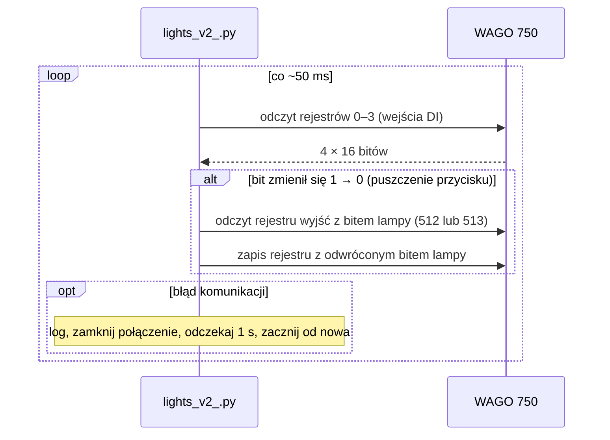
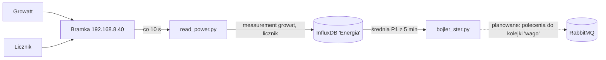

# Architektura

## Urządzenia

| Urządzenie | Adres | Rola |
|---|---|---|
| Raspberry Pi | host skryptów | uruchamia wszystkie skrypty, RabbitMQ, InfluxDB |
| WAGO 750 (sterownik PLC) | `192.168.8.5:502`, unit id `1` | wejścia z przycisków (DI), wyjścia na przekaźniki lamp i bojlera (DO) |
| Bramka Modbus TCP ↔ RTU | `192.168.8.40:502` | dostęp do urządzeń RS-485 |
| Falownik Growatt | bramka, unit id `2` | produkcja PV |
| Licznik energii | bramka, unit id `3` | napięcia, prądy, moce na fazach |

> **Stan produkcyjny (2026-09-18):** na Raspberry Pi `192.168.8.18` działa obsługa przycisków (`lights.service`) i panel WWW (`web.service`, [panel-www.md](panel-www.md)). Kolejka RabbitMQ, InfluxDB, rejestrator energii i sterowanie bojlerem opisane niżej istnieją w kodzie, ale nie są tam uruchomione. Szczegóły: [uruchomienie.md](uruchomienie.md#serwer-produkcyjny-stan-z-2026-09-18).

PLC nie ma własnej logiki oświetlenia (a przynajmniej kod na to nie wskazuje). To Raspberry Pi odczytuje przyciski i ustawia wyjścia. **Jeśli Pi albo skrypt nie działa, przyciski nie działają.**

## Oświetlenie — przepływ

Przyciski są monostabilne (dzwonkowe). `lights_v2_.py` odpytuje WAGO w pętli co ok. 50 ms:

Lampa przełącza się więc w momencie **puszczenia** przycisku. Stan lampy jest zawsze brany z WAGO, a nie trzymany w pamięci skryptu, więc restart skryptu nie gubi stanu świateł.

## Sterowanie zdalne — kolejka

`wago_750_comunication.py` nasłuchuje na kolejce RabbitMQ `wago` (localhost) i ustawia wyjścia po nazwie (`"swiatlo kuchnia"`, `"bojler grzanie"` …). Dzięki temu inne programy (np. przyszły sterownik bojlera czy interfejs WWW) nie muszą znać Modbusa. Format wiadomości: [kolejka.md](kolejka.md).

## Energia — przepływ

`bojler_ster.py` co minutę liczy średnią moc `P1` z ostatnich 5 minut i decyduje o grzaniu bojlera. Na razie **tylko wypisuje decyzję** — połączenie z kolejką (linia przerywana) nie jest zrobione. Wyjścia `bojler mieszadlo` i `bojler grzanie` są już zdefiniowane w konfiguracji.

## Dostęp do wyjść — wspólne założenia

Wszystkie skrypty sterujące wyjściami działają tak samo:

1. Odczytują cały obraz wyjść (255 rejestrów od 512) i zamieniają go na listę bitów.
2. Zmieniają wybrane bity.
3. Zapisują z powrotem **tylko te rejestry, które się zmieniły** — każdy jako całe 16 bitów.

Punkt 3 oznacza, że dwa procesy zapisujące jednocześnie ten sam rejestr mogą nadpisać sobie nawzajem zmiany (zob. [znane-problemy.md](znane-problemy.md)).
